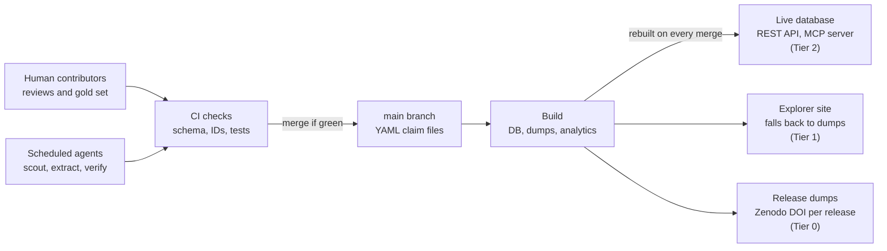
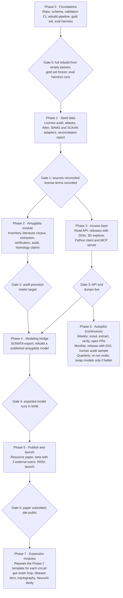
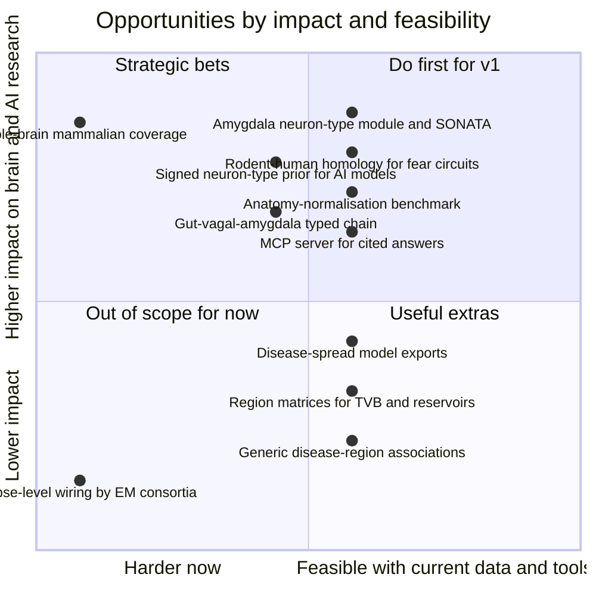

# Axonarium: Project Plan

> Compiled 2 October 2026 from the "Circuit Commons: Guiding Plan" doc (both tabs) plus every decision made later in the planning conversation.
>
> **Status:** the name *Axonarium* is confirmed. axonarium.com, axonarium.org and the axonarium organizations on GitHub, npm and PyPI were registered on 2 October 2026. This file holds Parts 1–3 of the plan; live status is in [STATUS.md](../STATUS.md).

## Contents

- **Part 1: Guiding plan.** Summary, motivation, design principles, data model, architecture, building blocks, visual explorer, MCP acceptance tests, agent operating model, phases and sprints (including the NeuroAI module), quality, sustainability, risks, success criteria, open decisions, references.
- **Part 2: Literature review.** What to reuse, where the gaps are, where the project matters most, and all sources.
- **Part 3: Decisions made after the plan.** Name, pitch, community input design, UI stack and templates, setup checklist and gotchas, how the project can advance AI.

---

# Part 1: Guiding plan

## Summary

Axonarium is an open, evidence-graded knowledge base of neural connectivity. It starts with the rodent amygdala and grows one circuit at a time toward whole-brain and brain–body coverage. Every connection is an aggregate of cited claims, each tagged with species, method and confidence, and exportable to simulators (SONATA, NeuroML).

It is designed to outlive its maintainers. The knowledge lives as plain files in a public GitHub repository; the database, website and API are rebuilt from those files. Scheduled AI agents do most curation and upkeep through pull requests that must pass automated checks, and humans audit a sample.

If people or funding disappear, the project degrades to a frozen, citable archive instead of breaking. The v1 target is rat and mouse amygdala connectivity at region and neuron-type level, with human homology edges, a public API, SONATA export and a resource paper.

## Motivation and gap

No existing resource stores connections as individually cited claims across species, treats homology as evidence, and exports to simulators. The pieces exist in silos, so this project integrates them rather than re-curating from scratch.

The full review of reusable resources, gaps and impact is in Part 2.

| Resource | Covers | Role in this project | What it lacks |
| --- | --- | --- | --- |
| [BAMS](https://bams1.org/) | About 65,000 rat connection reports from literature; nomenclatures for 5 species | Seed rat region edges, if the license allows | Self-described as sparsely populated; no API-first design |
| [Hippocampome.org](https://www.ncbi.nlm.nih.gov/pmc/articles/PMC10942544/) | Evidence-linked neuron types of the rodent hippocampal formation; drives simulations | Design template for a neuron-type knowledge base | One structure only; no amygdala equivalent exists |
| [SCKAN](https://sparc.science/tools-and-resources/6eg3VpJbwQR4B84CjrvmyD/) | Autonomic and peripheral nerve-to-organ connectivity, as RDF | Body layer: vagal and gut pathways | Not CNS-wide; limited sensory coverage |
| [Allen Mouse Brain Connectivity Atlas](https://www.ncbi.nlm.nih.gov/pmc/articles/PMC13417618/) | Mesoscale viral tracer connectivity in mouse | Seed mouse region edges | Mouse only; no literature evidence layer |
| [EBRAINS Knowledge Graph](https://www.ebrains.eu/data/find-data/find-data/) | Metadata graph of datasets and models (openMINDS) | Metadata conventions and cross-links | Indexes datasets, not connection claims |
| [BGMDB](https://www.sciencedirect.com/science/article/pii/S2001037025000601), gutMDisorder, GMMAD | Microbe–disease and microbe–metabolite associations | Later gut module | Not linked to neural pathways |

Cross-species mapping is the hardest part. Homology is often not one-to-one: the mouse caudoputamen resembles both human caudate and putamen, and some human association cortex has no clear mouse counterpart ([OTTER preprint](https://www.biorxiv.org/content/10.64898/2026.08.24.746652.full.pdf)). The data model therefore stores homology as weighted, cited claims, never as merged nodes.

## Design principles for self-sustainability

LLMs as a category will persist, but any specific model will be deprecated, repriced or replaced. Someone must also pay the bills and hold the keys. Sustainability therefore rests on three things no single model controls: open file formats, an eval harness that qualifies replacement models, and governance with more than one human.

1. **Files are the truth.** All knowledge lives as small, human-readable YAML files in git. Anyone can fork the entire project with one clone.
2. **Everything else is rebuildable.** The database, dumps, site and graph analytics are regenerated from files by one command. CI proves this on every release by rebuilding from empty.
3. **Agents contribute; they never own.** Agents open pull requests like any contributor. They never write to the database directly and never merge their own work.
4. **Model-agnostic roles.** Role prompts, schemas and the eval harness live in the repo. Any model that passes the gold-set eval can fill a role; none is hard-wired.
5. **Provenance on everything.** Each claim records its source, locator, curator (human or agent), model and prompt version. Bad batches can be found and reverted in one query.
6. **Degrade, don't break.** Each layer depends only on the layers below it (table below). Losing a layer freezes the project; it doesn't erase it.
7. **One module at a time.** Each new circuit repeats the same sprint template, so scope stays bounded and the process stays learnable.
8. **Humans steer and audit; agents do volume.** Human time goes to the gold set, audits, schema decisions and merges of code.
9. **Adopt, don't invent.** Use established standards, libraries and patterns wherever one fits (see Proven building blocks). Custom code is the last resort and needs an ADR explaining why nothing existing worked. This matters more with agents, which readily write bespoke code when a library already solves the problem.

| Tier | What runs | Depends on | If it stops |
| --- | --- | --- | --- |
| 0: Archive | Versioned data dumps on Zenodo and GitHub | Nothing ongoing | This is the floor; releases stay citable by DOI |
| 1: Static site | Pre-rendered explorer built from the latest dump | Free static hosting | Tier 0 remains downloadable |
| 2: Live API | Supabase Postgres, REST and MCP endpoints | A hosting account | Site falls back to static data |
| 3: Agent pipeline | Scheduled literature watch, extraction, verification, releases | LLM API budget and CI minutes | Knowledge freezes at the last release |

## Data model

The unit of knowledge is the claim: one statement from one source about one relationship in one species. Edges shown on the site are computed from claims and never edited by hand. The schema is written in LinkML so it generates JSON Schema, SQL and Python classes from one definition.

| Object | What it is | Standard IDs |
| --- | --- | --- |
| Region | A structure as defined in a specific, pinned atlas version | Atlas ID, mapped to UBERON |
| Neuron type | A cell population with location, transmitter and markers | Cell Ontology where it exists |
| Species | Host organism, and later microbes | NCBI Taxonomy |
| Source | A paper or dataset | DOI, PMID |
| Claim | One sourced statement about a relationship | Project ID |
| Edge | Aggregate of all claims for a subject, predicate and object | Derived at build time |
| Homology | A claim that a structure in one species corresponds to one in another | Project ID, with evidence and confidence |
| Disease, metabolite | Later modules | MONDO, ChEBI |

A claim file looks like this (values illustrative):

```yaml
id: clm-000123
subject: {type: region, id: "ccf:BLA", atlas: allen-ccf-v3}
predicate: projects_to
object: {type: region, id: "ccf:CEAm"}
species: NCBITaxon:10090
evidence_class: anterograde_tracer
result: present          # present | absent | ambiguous
sign: excitatory         # excitatory | inhibitory | modulatory | unknown
strength: {value: moderate, scale: ordinal}
source: {doi: "10.xxxx/placeholder", locator: "Fig. 3B"}
paraphrase: "Tracer injection in BLA labelled terminals in medial CeA."
curation: {by: agent, role: extractor, model: "<model id>", prompt: extract@1.0.0}
verification: {by: agent, role: verifier, verdict: agree}
status: accepted
extra:                   # open-ended, namespaced key/value pairs
  lab.injection_volume_nl: 50
  lab.tracer: AAV-hSyn-EGFP
  ui.highlight: true
```

Rules that keep the graph honest:

- **Evidence classes never share an edge type.** Anatomical (tracing, EM), structural imaging (tractography), functional (electrophysiology, optogenetics, co-activation) and association (disease, microbe) each get their own predicates.
- **Absence is data.** "Tested and not found" is stored as `result: absent`, distinct from no claim at all.
- **Homology is never a merge.** Rat BLA and human basolateral amygdala stay separate nodes, linked by a homology claim with its own evidence and confidence.
- **Atlas versions are pinned.** An atlas update creates a mapping file, not silent ID changes.
- **Copyright-safe evidence.** Store the locator and a paraphrase. Verbatim excerpts only for openly licensed papers, and kept short.

**Open-ended fields.** Every object (region, neuron type, source, claim, homology) carries an `extra` map of arbitrary JSON key/value pairs. It is stored as an indexed JSONB column in Postgres and returned unchanged by the API and dumps.

- Keys are namespaced (`lab.`, `model.`, `ui.`, or a contributor's own prefix) so they don't collide.
- Core facts (species, direction, sign, method, result) always stay in typed fields, never only in `extra`.
- When a key shows up widely, an ADR promotes it into the schema, and a migration moves the values.

**Numeric fields for modelers** (from the literature review): claims need numeric fields with units and uncertainty (connection probability, synapse count, conduction delay, sign), and exports must flag unknown values rather than fill them with defaults.

## Architecture

Git is the write path; everything the public sees is a read-only build product. Contributions arrive as pull requests, CI validates them, and a merge triggers a rebuild of the database, dumps and site.



Humans and scheduled agents write only through pull requests. Each merge rebuilds the live database and explorer; tagged releases also publish dumps with a DOI.

- **Write path:** YAML files in the repo, changed only by pull request (human or agent).
- **Checks:** schema validation, ID resolution against ontologies, DOI resolution, duplicate and contradiction detection, and a full rebuild test.
- **Build:** files become Postgres tables in Supabase, plus JSON-LD, CSV, Parquet and GraphML dumps. Graph analytics (paths, centrality, gap matrices) are precomputed in Python and stored as tables, since Postgres is not a graph engine.
- **Serve:** a visual Next.js explorer on Vercel (see Visual explorer), a REST API with an OpenAPI spec, a Python client and an MCP server for AI agents.
- **Release:** a tagged release publishes dumps to Zenodo with a DOI.
- **Auth:** the public site is read-only, so v1 needs no user accounts. Contributors authenticate through GitHub, where all writes happen. The one exception is the anonymous, insert-only community inbox described in Part 3, which still needs no accounts.

Repository layout:

```
axonarium/
  AGENTS.md            # read first: how any agent works here
  STATUS.md            # auto-generated: phase, open sprints, metrics
  SUCCESSION.md        # who holds which keys; what to do if they leave
  schema/              # LinkML schema, versioned
  data/
    entities/          # regions, neuron types, species, atlases
    claims/            # one YAML file per claim, sharded by module
    homology/
    sources/           # cached DOI metadata
    allowlist.yaml     # accepted evidence source types (human-owned; see Part 3)
  ingest/              # one adapter per external source
  agents/
    roles/             # role prompts: scout, extractor, verifier, triage...
    evals/             # gold set and harness (human-owned)
  build/               # files -> Postgres, dumps, SONATA
  site/                # Next.js explorer
  api/                 # OpenAPI spec, MCP server
  docs/decisions/      # architecture decision records (ADRs)
  .github/workflows/   # validate, build, release, deploy, scheduled agents
```

### Proven building blocks

Every layer uses an established standard or framework, and this table is the default answer to "what do we use for X?". Agents check it before writing new code; a new dependency needs an ADR, and replacing a listed choice needs human review.

| Need | Adopt | Instead of |
| --- | --- | --- |
| Schema and validation | LinkML | Hand-written JSON Schema, SQL and classes |
| Identifiers | UBERON, Cell Ontology, NCBI Taxonomy, MONDO, ChEBI | Project-invented IDs |
| Atlases, region hierarchies, meshes | [BrainGlobe Atlas API](https://github.com/brainglobe/brainglobe-atlasapi): Allen mouse, Waxholm rat, Allen human and more | Parsing each atlas by hand |
| Simulator export | SONATA, NeuroML | Custom network formats |
| Literature access | NCBI E-utilities, Europe PMC, Crossref APIs | Scraping publisher sites |
| Database and REST API | Supabase Postgres and its auto-generated REST API | A hand-written API server |
| Web framework and hosting | Next.js on Vercel | A custom rendering setup |
| UI components | shadcn/ui (Radix primitives, Tailwind) | Hand-built widgets |
| 3D scenes | three.js via React Three Fiber (plus drei helpers) | Raw WebGL |
| Network graphs | [react-force-graph](https://github.com/vasturiano/react-force-graph) for 2D and 3D; Sigma.js with Graphology for very large 2D graphs | Custom layout and rendering |
| Graph analytics | NetworkX or igraph in the build | Recursive SQL for everything |
| CI and schedules | GitHub Actions | External schedulers |
| Releases and DOIs | Zenodo GitHub integration | Manual uploads |
| Dependency upkeep | Dependabot or Renovate | Manual updates |
| Decision records | ADRs in MADR format | Scattered wiki notes |
| Citation | CITATION.cff | Ad hoc README text |
| AI agent access | Model Context Protocol (MCP) server | One plugin per AI client |
| Bot protection on public forms (Part 3) | Cloudflare Turnstile | Custom CAPTCHA |
| Reference export from the API (Part 3) | CSL-JSON and BibTeX | A custom citation format |

## Visual explorer

The site leads with two linked views of the same graph: a 3D brain with connections drawn between real region meshes, and a network view for structure. Selecting anything in one view highlights it in the other and opens its evidence.

**Anatomical view (3D).** Region meshes come from BrainGlobe, converted to glTF at build time and rendered with React Three Fiber. Connections are curved arcs between regions, coloured by evidence class and weighted by aggregate strength. Absent and contested connections look visibly different, and the species toggle swaps atlases while homology claims link corresponding regions.

**Network view (3D and 2D).** react-force-graph renders the same data as a force-directed graph, with directional particles along edges, curved links and click-to-focus. The hierarchy collapses and expands (amygdala, nuclei, neuron types). Very large graphs switch to Sigma.js in 2D.

Interactions worth building:

- **Path finder:** pick a start and end; the route animates hop by hop, each hop opening its citations.
- **Evidence drawer:** every node and edge opens its claims, sources, confidence and `extra` fields.
- **Filters:** species, evidence class, confidence and result (present or absent).
- **Knowledge over time:** a publication-year slider showing how the map filled in.
- **Gap mode:** highlights plausible but untested connections as research prompts.
- **Shareable state:** every view has a URL that restores camera, filters and selection.
- **Figure export:** PNG and SVG, ready for papers and talks.
- **Community buttons (Part 3):** each claim page has Supports and Contradicts buttons that accept a single paper identifier.

**Readable, not only beautiful.** 3D is best for orientation and impact; exact relationships read better in 2D and tables. Every 3D view has a 2D and table equivalent, which also covers accessibility and devices with weak WebGL.

**Performance.** Layouts and simplified meshes are precomputed in the build, and each view caps rendered nodes with level of detail. The bar is smooth interaction on a mid-range phone, tested in CI with a performance budget.

## Example questions and MCP acceptance tests

The MCP server is ready for launch when an agent answers all eight questions below correctly against the gold set, with a source for every edge. Each answer returns citations inside the result (DOI plus figure or section), exports references as CSL-JSON or BibTeX, and distinguishes "no claim found" from "tested and absent".

Citations are non-negotiable: every claim stores a DOI plus a locator, every edge is computed from claims, and MCP tools return sources inside each result rather than as an optional extra, so an agent cannot easily give an uncited answer.

| Question | What the server returns | Main users |
| --- | --- | --- |
| Build me a mouse BLA → CeA → PAG circuit in SONATA | A runnable subgraph; every edge cited, unknown parameters flagged rather than guessed | Modelers |
| Which BLA projections are shown in rat but untested in mouse? | A species-gap list | Experimentalists |
| Do papers disagree about parabrachial input to the central amygdala? | Conflicting claims side by side with method, species and figure | Experimentalists, reviewers |
| How strong is the evidence that rodent prelimbic → BLA models human dACC → amygdala? | Homology claims with confidence and evidence type | Translational researchers |
| Which routes connect gut vagal afferents to the central amygdala, and which hops are anatomical? | A typed chain, hop by hop, with missing links marked | Brain–body researchers |
| Which BLA targets show early tau pathology in mouse models? | Connectivity joined to disease claims, evidence tiers kept separate | Disease modelers |
| Give me a signed, weighted adjacency matrix of amygdala neuron types with uncertainty | A model-ready prior with provenance per entry | NeuroAI researchers |
| Fact-check the connectivity claims in this paragraph | Each statement marked supported, contradicted or unsupported, with links | Grant and paper writers |

## Agent operating model

Any agent, on any model, at any time, should be able to pick up a sprint card cold and finish it. The repo carries all context; nothing depends on an agent remembering a past session.

| Role | Does | Never does |
| --- | --- | --- |
| Builder | Code, schema changes, CI, site | Merge without human review |
| Ingester | Writes and runs adapters for structured sources | Edit claims from other sources |
| Scout | Runs saved PubMed queries; queues new papers | Extract claims |
| Extractor | Reads a paper, drafts claims as a PR | Verify its own claims |
| Verifier | Independently checks each claim against the source | See the extractor's reasoning first |
| Reconciler | Flags contradictions, duplicates, homology gaps | Resolve conflicts by majority vote |
| Steward | Dependency updates, link checks, releases, STATUS.md | Change data or evals |
| Triage (Part 3) | Reads the community inbox, validates and routes submissions, closes them with a reason | Change claims, or act on anything except structured fields |

The verifier should use a different prompt and, where budget allows, a different model family from the extractor, so their errors are less correlated.

**Work units.** Each sprint is a GitHub issue built from a template: ID, goal, dependencies, inputs, deliverables, done-when, role and whether a human gate applies. Labels: `phase-N`, `agent-ready`, `needs-human`, `blocked`.

**Handoff protocol** (written into AGENTS.md):

1. Read AGENTS.md, STATUS.md, the sprint card and any linked ADRs.
2. Assign the card and comment that work has started.
3. Work on a branch in small pull requests.
4. End every session with a handoff comment: done, not done, surprises, next step.
5. Record any design choice as an ADR in `docs/decisions/`.
6. Never leave `main` failing CI.

**Merge tiers:**

| Change | Merge rule |
| --- | --- |
| Schema, code, CI, role prompts | Human review required |
| Claims ingested from a structured source | Auto-merge on green CI |
| Extracted claims, verifier agrees | Auto-merge on green CI; enters the audit pool |
| Extracted claims, verifier disagrees or low confidence | Human review queue |
| Deletions, retractions, gold-set changes | Human review required |
| Allowlist changes (Part 3) | Human review required |

**Guardrails.** A monthly spending cap per scheduled job, enforced in CI. CODEOWNERS locks the gold set, evals, allowlist and merge rules to humans. Every agent PR is labelled with model and prompt version. Agent workflows never run with secrets on pull requests from forks (see the setup checklist in Part 3).

## Phases and sprints

Six phases take the project from an empty repo to a published v1, after which it runs on autopilot and grows by modules. Each phase ends at a gate that must pass before the next depends on it; phases 2 and 3 can run in parallel. Sprints are sized for one to a few agent sessions, with no calendar dates until the maintainer decides how much time is available.



Phases 2 and 3 run side by side; autopilot begins once the API and dumps are live, and expansion modules follow the v1 launch.

| ID | Sprint | Depends on | Done when | Who |
| --- | --- | --- | --- | --- |
| 0.1 | Repo scaffold: GitHub org, licenses, AGENTS.md, CODEOWNERS, sprint-card template | — | Public repo; CI runs on the empty project | Agent + review |
| 0.2 | Schema v0.1 in LinkML | 0.1 | 20 hand-written example claims validate; JSON Schema and SQL generated | Agent + review |
| 0.3 | Validation CI | 0.2 | Deliberately broken fixtures fail CI for the right reason | Agent |
| 0.4 | Rebuild pipeline: files to Postgres and dumps | 0.2 | One command rebuilds from an empty database in CI | Agent |
| 0.5 | Gold set: about 150 amygdala claims plus about 30 known-absent pairs | 0.2 | Reviewed and frozen as gold v1 | Maintainer |
| 0.6 | Eval harness: score any model and prompt against the gold set | 0.5 | Two different models scored and reported | Agent |
| 1.1 | License audit of candidate sources | 0.1 | Reuse terms per source recorded in an ADR | Agent + review |
| 1.2 | Atlas layer via BrainGlobe: mouse, rat and human hierarchies and meshes, UBERON mappings, pinned versions | 0.2 | Every amygdala region resolves in each atlas | Agent + review |
| 1.3 | Allen mouse connectivity adapter | 1.1, 1.2 | Region-level claims ingested; rerun is idempotent | Agent |
| 1.4 | BAMS rat adapter, if licensed | 1.1, 1.2 | As 1.3 | Agent |
| 1.5 | SCKAN adapter for vagal pathways | 1.1, 1.2 | RDF converted to claims; round-trip test passes | Agent |
| 1.6 | Reconciliation report | 1.3–1.5 | Agreement, conflict and silence between sources, as a figure in the repo | Agent + review |
| 2.1 | Amygdala inventory: nuclei, subdivisions, neuron types, synonyms | 1.2 | Rat and mouse entities merged to main | Maintainer + agent |
| 2.2 | Literature corpus: saved PubMed queries, open-access full text, dedup | 2.1 | Corpus manifest committed | Agent |
| 2.3 | Extraction in batches of about 50 papers | 0.6, 2.2 | Each batch is a PR with provenance | Agent |
| 2.4 | Independent verification pass | 2.3 | Every extracted claim has a verdict | Agent |
| 2.5 | Audit sprint: stratified sample, measure precision, revise prompts | 2.4 | Audit precision recorded in STATUS.md | Maintainer |
| 2.6 | Homology claims for amygdala nuclei, rat to mouse to human | 2.1 | Each claim has evidence and a confidence | Agent + review |
| 3.1 | Read API with OpenAPI spec | 0.4 | Endpoints documented and tested against the dump | Agent |
| 3.2 | Release job: dumps plus Zenodo DOI | 0.4 | A test release gets a DOI | Agent + review |
| 3.3 | Explorer v1: linked 3D anatomical and network views, evidence drawer, filters, species toggle | 3.1 | Smooth on a mid-range phone; every 3D view has 2D and table equivalents; falls back to static data | Agent + review |
| 3.4 | Python client and MCP server | 3.1 | An LLM agent answers a pathway question with citations | Agent |
| 3.5 | Visual design pass: design tokens, motion, path animation, gap mode, figure export | 3.3 | The maintainer approves the look; accessibility and performance budgets pass in CI | Agent + review |
| 4.1 | SONATA export for any subgraph | 3.1 | Export loads in bmtk; unknown parameters flagged, not guessed | Agent |
| 4.2 | Worked example: rebuild a published amygdala model's wiring from the knowledge base | 4.1, 2.5 | Side-by-side comparison with the original model | Maintainer + agent |
| 4.3 | NeuroML export (optional) | 4.1 | Loads in a NeuroML tool | Agent |
| 5.1 | Resource paper draft | 4.2 | Draft ready for co-authors | Maintainer + agent |
| 5.2 | Beta with at least 3 external users | 3.3 | Top issues fixed | Maintainer |
| 5.3 | Launch: RRID, INCF listing, announcement | 5.1, 5.2 | Paper submitted; site public | Maintainer |

The community-input sprints (C.1–C.5) are listed in Part 3.

**Phase 6, autopilot** (continuous, after the Phase 3 gate):

- Weekly: scout, extract, verify, open PRs.
- Monthly: release with a Zenodo DOI; audit sample reviewed.
- Quarterly: re-run evals on the current model and candidates; swap only if a candidate matches or beats it.
- Ongoing: dependency updates, link checks, STATUS.md regenerated, community inbox triaged.

**Phase 7, expansion modules** (each repeats the Phase 2 template):

- 7a: Vagal gut–brain loop (NTS, parabrachial nucleus, central amygdala), linked to SCKAN, with microbe and metabolite nodes as association evidence.
- 7b: Disease layer with separate tiers for causal and associational evidence.
- 7c: Human connectivity from tractography, as its own evidence class.
- 7d: Regions requested by the community.
- 7e: NeuroAI research module, amygdala-prior networks (detailed below). A research study that uses the knowledge base, rather than a curation module.

### 7e. NeuroAI module: amygdala-prior networks

This module tests whether wiring a recurrent network like the amygdala, plus a slow interoceptive input, improves learning on threat and value tasks compared with generic architectures. It can start once Gate 4 passes, in parallel with Phase 5, and is worth publishing whichever way the results fall.

Pre-registered hypotheses:

1. **H1, sample efficiency.** A signed amygdala-graph network learns fear conditioning, extinction and reversal from fewer training examples than a random sparse network of the same density and sign ratio.
2. **H2, stability.** Adding a slow interoceptive channel reduces forgetting when tasks alternate.
3. **H3, biological behaviour.** Trained networks show recognisable extinction phenomena, such as spontaneous recovery or renewal, that baselines don't.

| Component | Choice |
| --- | --- |
| Network prior | Signed, weighted amygdala neuron-type adjacency with uncertainty (acceptance test 7) |
| Internal-state input | A slow channel entering through the parabrachial–central amygdala route, from module 7a |
| Tasks | Fear conditioning, extinction, reversal and context switching; NeuroGym where tasks exist, documented custom tasks only where they don't |
| Frameworks | conn2res for reservoir variants; PyTorch for trainable recurrent networks |
| Baselines | Random sparse network matched for density and sign ratio; spatially embedded RNN; dense RNN |
| Null controls | Degree-preserving shuffled graph, and a sign-shuffled graph, since sign changes are known to alter reservoir performance |
| Metrics | Sample efficiency, forgetting across task switches, extinction and recovery behaviour, similarity of learned weights to the biological graph |

| ID | Sprint | Depends on | Done when | Who |
| --- | --- | --- | --- | --- |
| 7e.1 | Pre-register hypotheses, tasks, metrics and baselines | 4.1 | Registration published (for example on OSF) | Maintainer |
| 7e.2 | Export the signed amygdala prior with uncertainty, plus null variants | 2.5, 4.1 | Matrices and both nulls included in a tagged release | Agent |
| 7e.3 | Build the task suite | None | Tasks run in NeuroGym or documented custom environments | Agent + review |
| 7e.4 | Train models and baselines across multiple random seeds | 7e.2, 7e.3 | Results table with confidence intervals | Agent |
| 7e.5 | Add the interoceptive channel and run the ablation | 7a, 7e.4 | Results with and without the channel | Agent + review |
| 7e.6 | Analyse and write up | 7e.4, 7e.5 | Preprint drafted, null results reported in full | Maintainer + agent |

## Quality and validation

The gold set is the project's anchor: a frozen, human-curated sample that every model and prompt must pass before it touches the data. It is the one artifact agents can never edit, and the main reason model swaps are safe.

| Metric | Measured by | Proposed target |
| --- | --- | --- |
| Extraction precision | Eval harness on the gold set | At least 0.90 to run unattended |
| Extraction recall | Eval harness on the gold set | Tracked, no gate in v1 |
| Field accuracy (species, direction, sign, method) | Eval harness, per field | At least 0.90 per field |
| Audit precision | Monthly human review of a random sample of auto-merged claims | At least 0.90, or auto-merge pauses |
| Verifier agreement | Share of extracted claims the verifier accepts | Tracked; a sudden drop flags drift |
| Cross-source agreement | Overlap with Allen and BAMS edges | Reported per release |
| Open contradictions | Reconciler output | Reported, never auto-resolved |

Other checks:

- **Model swaps:** a candidate replaces the incumbent only if it matches or beats it on the gold set.
- **Retractions:** sources are checked against Crossref retraction metadata each release; affected claims are flagged, not silently deleted.
- **Contradictions stay visible:** an edge with conflicting claims shows both sides and their evidence.
- **Gold set growth:** add new gold claims only by human review, as a versioned release (gold v2 and so on).
- **Recall matters** (from the literature review): LLM extraction errors are mostly omissions, not inventions, so the pipeline should include a pass that hunts for missed claims.
- **Never trust one verifier** (from the literature review): verifiers disagree on which citations are unsupported, so keep the human audit sample.

**Open question for the maintainer:** the whole quality system depends on the maintainer hand-curating the gold set of about 150 claims. Is that realistic, or should the plan budget for a second curator?

## Sustainability and governance

The project survives a departed maintainer if three things are true: it lives in an organization rather than a personal account, at least two humans hold every key, and the data is archived somewhere no one has to pay for. Agents reduce labor; they don't remove the need for someone to hold the keys.

**Running costs, by tier:**

| Item | Cost profile | Note |
| --- | --- | --- |
| CI and scheduled jobs | Free | GitHub Actions is [free and unlimited on public repos](https://docs.github.com/billing/managing-billing-for-github-actions/about-billing-for-github-actions) with standard runners |
| LLM API calls | Largest variable cost | Hard monthly cap in CI; pipeline pauses when reached |
| Supabase | Free, or paid for reliability | Free projects [pause after a week of inactivity](https://supabase.com/docs/guides/platform/free-project-pausing); paid projects never pause. Free plan allows 2 active projects |
| Vercel | Free Hobby tier, with conditions | Non-commercial use only; public repos only when owned by a GitHub organization; one seat. See the setup checklist in Part 3. The Vercel Open Source Program offers credits |
| Domain | Small, annual | Register for several years, auto-renew, keep a free fallback URL. Buy both .com and .org |
| Zenodo archive | Free | The Tier 0 floor |

The Supabase pause is a concrete example of why the static fallback matters: if the API pauses, the site should keep serving the last release.

**Keys and succession:**

- Everything lives under a GitHub organization with at least two owners.
- Hosting, domain and API keys are owned by the organization, with a second admin on each.
- All accounts use a project email alias, not a personal address.
- SUCCESSION.md lists every account, who holds it and how to hand it over.
- Seek an institutional home (a lab, a university or INCF) that can take over the organization if owners step away.

**Licensing and credit:**

- Code under MIT or Apache-2.0; project-curated data under CC BY 4.0.
- Ingested data keeps its upstream license, recorded per source (sprint 1.1). Non-commercial data (for example the Allen Brain Cell Atlas 10x single-cell data, CC BY-NC 4.0) is linked, not copied.
- CITATION.cff in the repo; each release citable by DOI.
- A Code of Conduct in the repo from the first commit.
- Human contributors are identified by ORCID in curation records. Agents are credited as tools in methods, not as authors.
- Privacy-respecting usage metrics from launch, and an RRID, so funders can see use (from the literature review).

## Risks and mitigations

The biggest risks are quality drift from unattended extraction and scope creep, not technology. Both are handled by gates rather than good intentions.

| Risk | Mitigation |
| --- | --- |
| LLM extraction invents or distorts claims | Independent verifier, gold-set gate, monthly audit; auto-merge pauses below target |
| A model is deprecated or repriced | Model-agnostic roles; eval harness qualifies a replacement before swap |
| Silent drift after a model or prompt change | Provenance on every claim; any batch can be found and reverted |
| Scope creep toward whole brain too early | Module template; a new module starts only after the previous gate passes |
| Upstream license blocks redistribution | License audit before any adapter; restricted data linked, not copied |
| Misleading disease associations | Separate evidence tiers; disease layer deferred to Phase 7 |
| Copyright on evidence text | Locators and paraphrases; short excerpts only from openly licensed papers |
| Atlas updates break region IDs | Pinned atlas versions; explicit mapping files between versions |
| Maintainer burnout or departure | Two-owner org, SUCCESSION.md, degradation tiers, institutional home |
| API budget runs out | Hard cap; pipeline pauses and the rest keeps serving |
| Nobody uses it | Beta with 3 external users before launch; SONATA export targets a concrete audience |
| Prompt injection via community submissions or hidden text in papers | Identifier-only submissions, allowlist, trusted-API fetching, no-tool readers, hidden-text stripping (Part 3) |
| Leaked secrets through CI | Agent jobs never run with secrets on fork PRs; fine-grained tokens or a GitHub App (Part 3) |

## Success criteria for v1

v1 succeeds when someone outside the project uses it for real work and the pipeline runs without daily human attention.

- [ ] Someone outside the maintainer's lab builds or constrains a model using the knowledge base
- [ ] Resource paper submitted (for example to Scientific Data or eLife Tools and Resources)
- [ ] Extraction precision on the gold set and audit precision both at or above target
- [ ] Rat and mouse amygdala covered at region and neuron-type level, with human homology claims
- [ ] SONATA export loads in bmtk for any amygdala subgraph
- [ ] Autopilot runs 3 consecutive months needing only audits and code reviews
- [ ] A full rebuild from an empty database passes on every release
- [ ] At least two people hold admin access to every account
- [ ] The MCP server passes all eight acceptance tests with citations

## Open decisions

These are the maintainer's to make before Phase 0 closes; each should end up as an ADR.

- [x] Project name: Axonarium ([ADR 0003](decisions/0003-project-name.md))
- [ ] Solo with agents, or with collaborators from the start? This sets how many human gates are realistic.
- [ ] Who curates the gold set (the maintainer alone, or with a second curator)
- [ ] Rat and human reference atlases to pin (mouse defaults to Allen CCF v3)
- [ ] Target thresholds for precision gates (0.90 is a proposal)
- [ ] Supabase on the free tier with static fallback, or a paid plan from launch
- [ ] Vercel Hobby with GitHub Actions deploys, or Pro (possibly via Open Source Program credits)
- [ ] Monthly LLM budget cap, and daily cap on community submissions processed
- [ ] Institutional home to approach
- [ ] Which published amygdala model to rebuild in sprint 4.2
- [x] Code licence: Apache-2.0 ([ADR 0002](decisions/0002-licensing.md))

## References (Part 1)

- [BAMS: Brain Architecture Knowledge Management System](https://bams1.org/)
- [Hippocampome.org 2.0 (eLife)](https://www.ncbi.nlm.nih.gov/pmc/articles/PMC10942544/)
- [Graph theoretic analyses of the hippocampal potential connectome (eNeuro)](https://www.ncbi.nlm.nih.gov/pmc/articles/PMC5114701/)
- [SCKAN: SPARC Connectivity Knowledge Base](https://sparc.science/tools-and-resources/6eg3VpJbwQR4B84CjrvmyD/)
- [Developing a multiscale neural connectivity knowledgebase of the autonomic nervous system (Frontiers in Neuroinformatics)](https://www.frontiersin.org/journals/neuroinformatics/articles/10.3389/fninf.2025.1541184/full)
- [Experimental quality control induces changes in Allen mouse brain connectomes](https://www.ncbi.nlm.nih.gov/pmc/articles/PMC13417618/)
- [EBRAINS Knowledge Graph](https://www.ebrains.eu/data/find-data/find-data/)
- [BGMDB: gut microbiota and brain disorders](https://www.sciencedirect.com/science/article/pii/S2001037025000601)
- [gutMDisorder v2.0 (Nucleic Acids Research)](https://academic.oup.com/nar/article/51/D1/D717/6754909)
- [Probabilistic mouse–human brain correspondence by optimal transport (OTTER preprint)](https://www.biorxiv.org/content/10.64898/2026.08.24.746652.full.pdf)
- [Connectome-constrained networks predict neural activity across the fly visual system (Nature)](https://www.nature.com/articles/s41586-024-07939-3)
- [Supabase: free project pausing](https://supabase.com/docs/guides/platform/free-project-pausing)
- [GitHub Actions billing](https://docs.github.com/billing/managing-billing-for-github-actions/about-billing-for-github-actions)

---

# Part 2: Literature review — what to reuse, where the gaps are

Reviewed 1 October 2026.

Nothing like this project exists, but almost every ingredient does. Mouse tracer and single-neuron data, a BLA connectivity atlas, standard IDs, vagal and microbiome resources, LLM extraction tools and simulator formats are all available to reuse.

The gaps are in joining them: cited cross-species claims, homology treated as evidence, signed neuron-type wiring, and an unbroken gut-to-brain chain. Those same gaps are where the project matters most for AI, because the connectome-constrained models that work today depend on exactly the signed, typed wiring that mammalian resources lack.

## 1. Connectivity data to ingest

Mammalian connectivity exists at three scales that rarely meet: mesoscale tracer maps of whole brains, single-neuron reconstructions in the thousands, and synapse-level EM of about one cubic millimetre. Only the fly has a complete synaptic connectome. For the amygdala v1, mouse is well served by tracer atlases and rat by BAMS, but no resource joins them as cited, comparable claims.

| Resource | Species | Method and scale | What it gives this project |
| --- | --- | --- | --- |
| [Mouse Connectome Project BLA atlas](https://www.nature.com/articles/s41467-021-22915-5) (Hintiryan et al. 2021) | Mouse | Anterograde and retrograde tracing of every BLA nucleus; projection-defined neuron types | The closest existing seed for v1. Defines three new anterior BLA domains, each with distinct projection neuron types; [maps are online](https://journals.sagepub.com/doi/full/10.1177/26331055221080175) |
| Allen Mouse Brain Connectivity Atlas | Mouse | Viral anterograde tracing registered to CCFv3 | Region-level directed, weighted edges. Treat as versioned: [re-running QC changed the derived connectome](https://www.ncbi.nlm.nih.gov/pmc/articles/PMC13417618/) |
| [Single-neuron morphologies](https://www.nature.com/articles/s41586-021-03941-1) (BICCN SEU-Allen, Janelia MouseLight) | Mouse | 1,741 + 1,200 complete axon reconstructions in CCFv3 | Projection evidence at neuron-type level; [a 2025 single-neuron connectome](https://www.nature.com/articles/s41592-025-02784-2) adds 2.57 million predicted boutons from 1,877 neurons |
| [BAMS](https://bams1.org/) | Rat | Literature-curated connection reports | About 65,000 rat reports; seed rat edges if licensing allows |
| [Marmoset Brain Connectivity Atlas](https://www.nature.com/articles/s41467-020-14858-0) | Marmoset | 143 retrograde injections in 52 animals, cortex | Weighted primate cortical edges (fraction of labelled neurons); a stepping stone to human |
| [Brain/MINDS Marmoset Connectivity Resource](https://dataportal.brainminds.jp/marmoset-connectivity-atlas) | Marmoset | Anterograde, retrograde and diffusion tractography in one space | Lets the project calibrate tractography against tracer evidence |
| [MICrONS](https://mcgovern.mit.edu/2025/12/15/all-the-connections/) | Mouse | EM of 1 mm³ visual cortex, over half a billion synapses, plus recorded activity | Synapse-level ground truth for local circuits; structure linked to function |
| [H01](https://www.science.org/doi/10.1126/science.adk4858) | Human | EM of 1 mm³ temporal cortex; about 57,000 cells and 150 million synapses | Human synaptic statistics, including rare inputs of up to 50 synapses |
| [FlyWire](https://www.nature.com/articles/s41586-024-07558-y) and [BANC](https://blog.flywire.ai/) | Fly | Whole brain: 139,255 neurons and 54.5 million synapses; BANC adds the nerve cord | Not mammalian, but the benchmark where connectome-constrained AI already works |
| [SCKAN](https://sparc.science/tools-and-resources/6eg3VpJbwQR4B84CjrvmyD/) | Multi-species | Expert and literature-derived autonomic populations | The body layer (section 3) |

A synapse-level mouse connectome is [estimated at 10 to 15 years away](https://mcgovern.mit.edu/2025/12/15/all-the-connections/). Until then, curated mesoscale and neuron-type claims are the only whole-brain mammalian wiring available.

## 2. Atlases, cell types and ontologies

Identifiers are a solved problem if the project adopts what exists. UBERON and the Cell Ontology anchor anatomy and cells, the Neuron Phenotype Ontology describes neuron types, BrainGlobe serves rodent atlases, and siibra serves the human atlas.

| Resource | Covers | Use in this project |
| --- | --- | --- |
| [BrainGlobe Atlas API](https://github.com/brainglobe/brainglobe-atlasapi) | Around 200 atlases, including Allen mouse, Waxholm and SWC rat, and Allen human, with region meshes and hierarchies | Atlas layer and 3D meshes for the explorer |
| [Allen Brain Cell Atlas](https://alleninstitute.github.io/abc_atlas_access/descriptions/WMB-taxonomy.html) | Whole mouse brain: 5,322 transcriptomic clusters in 34 classes, 338 subclasses and 1,201 supertypes | Molecular identity for neuron-type nodes. A [consensus taxonomy](https://alleninstitute.github.io/abc_atlas_access/descriptions/Consensus-WMB-taxonomy.html) (Oct 2025) has 6,721 clusters |
| [Neuron Phenotype Ontology](https://www.ncbi.nlm.nih.gov/pmc/articles/PMC9547803/) | Neuron types as bundles of phenotypes: species, region, molecules, morphology, projection targets | The natural schema for neuron-type entities; SCKAN already uses it |
| Cell Ontology and [Provisional Cell Ontology](https://www.nature.com/articles/s41597-022-01886-2) | Reference cell types plus data-driven types from BICCN | Stable IDs for cell types, with a route for new ones |
| [BICAN](https://www.biorxiv.org/content/10.64898/2026.04.14.717814.full.pdf) | Standardised cell atlases of human, macaque, marmoset and mouse; a cross-species basal ganglia atlas | Cross-species cell-type homology, the cell-level counterpart to region homology |
| [siibra and Julich-Brain](https://www.nature.com/articles/s41592-026-03159-x) | Human multilevel atlas: probabilistic maps of over 200 areas per hemisphere, with a web API | Human region IDs and 3D maps |
| [Human Reference Atlas](https://www.nature.com/articles/s41592-024-02563-5) (HuBMAP) | Whole human body: 4,499 anatomical structures, 1,195 cell types, 2,089 biomarkers in 33 tables | Body-wide anatomy anchors for gut and organ nodes |

Licences differ even within one resource. The Allen Brain Cell Atlas releases its MERFISH data under CC BY 4.0 but its 10x single-cell data under [CC BY-NC 4.0](https://knowledge.brain-map.org/data/LVDBJAW8BI5YSS1QUBG), so the project should link non-commercial data rather than copy it.

## 3. Body, interoception and gut

Every link in the chain from gut microbe to emotional circuit has been studied, but in separate resources that don't reference each other. Microbiome databases stop at disease associations, SCKAN stops at the brainstem, and the cell-level vagal atlases live only in papers.

| Resource | What it covers | Role here |
| --- | --- | --- |
| [SPARC Portal maps](https://docs.sparc.science/docs/introduction-to-maps) | Anatomical and functional connectivity flatmaps plus 3D whole-body scaffolds, generated from SCKAN | Reference IDs and pathways for the autonomic body layer; link out rather than duplicate |
| [Vagal interoceptive atlas](https://www.nature.com/articles/s41586-022-04515-5) (Zhao et al. 2022) | Single-cell profiles of vagal sensory neurons from seven mouse organs | Neuron-type nodes for vagal afferents, coded by organ, tissue layer and stimulus type |
| [Brainstem map for visceral sensations](https://www.nature.com/articles/s41586-022-05139-5) (Ran et al. 2022) | Distinct NTS domains engaged by distinct visceral inputs | The CNS entry point; joins vagal afferent types to NTS domains |
| [Neuropod cells](https://www.science.org/doi/10.1126/science.aat5236) (Kaelberer et al. 2018) | Enteroendocrine cells that synapse on vagal neurons using glutamate | A one-synapse route from gut lumen to brainstem; the first neural edge after the epithelium |
| [GMMAD](https://bmcgenomics.biomedcentral.com/articles/10.1186/s12864-023-09599-5) | 3,836 disease–microbe and 879,263 microbe–metabolite associations | Microbe and metabolite nodes, as association evidence |
| [BGMDB](https://www.sciencedirect.com/science/article/pii/S2001037025000601) | 1,419 associations between 609 microbial taxa and 43 brain diseases | Microbe–brain-disease associations |
| [gutMDisorder v2](https://academic.oup.com/nar/article/51/D1/D717/6754909) | Curated microbe–disorder and intervention associations, human and mouse kept separate | Species-tagged association claims |

The join this project can make is a typed chain: microbe, metabolite, epithelial sensor, vagal afferent type, NTS domain, then onward to parabrachial and amygdala targets. Each hop carries its own evidence class, so a microbe–disease correlation never masquerades as an anatomical pathway.

## 4. Literature mining and LLM extraction

Automated connectivity extraction was tried a decade ago and stalled on two problems: mapping region names to standard IDs, and statements that span sentences. Current LLM agents largely solve the reading but not the normalisation, and their main failure is omission rather than invention.

| Work | Finding | Implication for this project |
| --- | --- | --- |
| [WhiteText](https://pubmed.ncbi.nlm.nih.gov/26052282/) (French et al. 2012, 2015) | 5,208 hand-annotated connectivity statements from abstracts; classifier reached 67% recall at 51% precision | A ready-made training and test corpus. Its lessons: [27% of statements cross sentences](https://www.frontiersin.org/journals/neuroinformatics/articles/10.3389/fninf.2016.00039/full), and [only 63% of region mentions resolved to a lexicon](https://dx.doi.org/10.1093/bioinformatics/bts542) |
| [PubTator 3.0](https://academic.oup.com/nar/article/52/W1/W540/7640526) (NCBI) | Over a billion entity and relation annotations across about 36 million abstracts and 6 million full texts, updated weekly | Use for genes, chemicals, diseases and species. It does not tag brain regions, so anatomy normalisation is this project's job |
| [PaperQA2](https://arxiv.org/abs/2409.13740) (FutureHouse) | Open-source agent matching or beating experts on literature questions; about 70% of the contradictions it flagged were confirmed by experts | A candidate engine for the Verifier and Reconciler roles |
| [LLM data extraction, systematic review](https://pubmed.ncbi.nlm.nih.gov/42501879/) (Dec 2025) | Accuracy ranged from 47% to 99.9%; omissions made up 60–74% of errors, while hallucination rates were 0.08–6% | Measure recall, not just precision. A second pass that hunts for missed claims is worth more than one that hunts for invented ones |
| [Citation faithfulness study](https://arxiv.org/pdf/2607.20527) (2026) | The same agent outputs scored 3% to 18% unsupported depending on which verifier judged them | Never trust one verifier; keep the human audit sample |
| [BrainBench](https://www.nature.com/articles/s41562-024-02046-9) (Luo et al. 2025) | LLMs predicted neuroscience results better than human experts | Models carry latent neuroscience knowledge, but it is uncited. A grounded knowledge base is how to check it |
| [Mental Disorders Knowledge Graph](https://pubmed.ncbi.nlm.nih.gov/40804250/) (Nat Commun 2025) | LLM-built graph that attaches source, sample and context metadata to each triple | Confirms claim-level context is feasible at scale |

The practical pipeline is therefore: PubTator for entity tagging, an LLM extractor for connectivity claims, a project-owned anatomy normaliser built on UBERON and atlas synonyms, and an independent verifier. WhiteText plus the project's own gold set become the benchmark.

## 5. Modeling standards and export targets

Two export formats cover nearly every modeler: SONATA for cell- and population-level networks, and a region-by-region weight and tract-length matrix for whole-brain models. Both already have mature open simulators, so the project only needs to emit the files.

| Target | What it is | Why it matters here |
| --- | --- | --- |
| [SONATA](https://journals.plos.org/ploscompbiol/article?id=10.1371%2Fjournal.pcbi.1007696) | Network format built by the Allen Institute and Blue Brain; read by BMTK, NetPyNE, PyNN and pyNeuroML for NEURON and NEST | Primary export for neuron-type subgraphs, straight into existing bmtk workflows |
| [Billeh et al. 2020 mouse V1 model](https://modeldb.science/showmodel?model=265592) | Two multi-scale V1 models built in BMTK from literature curation plus large experimental surveys | The closest precedent for "knowledge base to simulation"; its curation tables show which fields a modeler actually needs |
| [Hippocampome.org v2](https://www.ncbi.nlm.nih.gov/pmc/articles/PMC10942544/) | Knowledge base that supplies connection probabilities and neuron parameters for spiking simulations | Proof that a curated knowledge base can parameterise real-scale simulations |
| [The Virtual Brain and Virtual Mouse Brain](https://www.ncbi.nlm.nih.gov/pmc/articles/PMC5489253/) | Whole-brain region models driven by tracer or diffusion connectomes, hosted on EBRAINS | Region-level export target; already runs on Allen tracer matrices |
| [Virtual Brain Inference](https://elifesciences.org/articles/106194) | Bayesian parameter inference for whole-brain models | Lets users fit models built from the knowledge base to their own recordings |
| [Open Brain Institute](https://www.openbraininstitute.org/about) | Successor to Blue Brain: about 290 repositories and 18 million lines of simulation code | Reusable builders and analysis tools, such as SNAP for SONATA circuits |
| [ModelDB](https://modeldb.science/showmodel?model=265592) and [Open Source Brain](https://www.ncbi.nlm.nih.gov/pmc/articles/PMC6693896/) | Model repositories | Where exported models and worked examples should be deposited |

The main schema consequence: claims need numeric fields with units and uncertainty (connection probability, synapse count, conduction delay, sign), and exports must flag unknown values rather than fill them with defaults.

## 6. Connectome-constrained and brain-inspired AI

Wiring diagrams have already produced working AI-style models, but only where the wiring is complete and carries a sign: the fly. Mammalian work uses either a cubic millimetre of EM or abstract spatial rules. No one has a whole-brain mammalian prior with cell types, signs and body inputs, and that is the opening for this project.

| Study | What it showed | Data it depended on | What it means here |
| --- | --- | --- | --- |
| [Lappalainen et al. 2024](https://www.nature.com/articles/s41586-024-07939-3) | Wiring plus task training predicted activity across 64 cell types of the fly visual system | Complete cell-type wiring of one circuit | The template. A mammalian version needs neuron-type wiring, which this project curates |
| [Shiu et al. 2024](https://www.nature.com/articles/s41586-024-07763-9) | A whole fly-brain spiking model predicted feeding and grooming circuits, confirmed by optogenetics | Connectivity plus predicted transmitter, with [a single free parameter](https://arxiv.org/pdf/2510.15745) | Sign and transmitter identity are what made it work. Tracer data lacks both, so claims must capture them |
| [Whole-brain fly locomotion](https://arxiv.org/pdf/2602.17997) and [resting-state models](https://www.biorxiv.org/content/10.64898/2026.08.21.745055.full.pdf) (2026) | Connectome graphs used as controller architecture for an embodied body, and fitted to spontaneous activity | Whole-brain synaptic wiring | Brain–body loops are now being simulated end to end in insects |
| [Wang et al. 2025](https://www.nature.com/articles/s41586-025-08829-y) (MICrONS digital twin) | A foundation model predicted responses to new stimuli, and predicted cell types and connectivity from function | Large-scale recordings plus EM of one cortical volume | Function and structure inform each other; local, not whole-brain |
| [conn2res](https://www.nature.com/articles/s41467-024-44900-4) (Nat Commun 2024) | Open toolbox that turns any connectome into a reservoir network for cognitive tasks | A connectivity matrix | An immediate consumer of this project's exports. Follow-up work found that [changing weight signs altered task performance](https://link.springer.com/chapter/10.1007/978-981-95-4100-3_16) |
| [Spatially embedded RNNs](https://www.nature.com/articles/s42256-023-00748-9) (Achterberg et al. 2023) | Wiring-cost constraints alone produced brain-like modularity and small-world structure | Abstract spatial rules | [Later work](https://arxiv.org/html/2606.14975) found that measured cortical organisation made networks better learners, not just more brain-like |
| [Homeostatic and interoceptive RL](https://www.sciencedirect.com/science/article/pii/S2352154625001305) | Agents that treat internal-state regulation as reward learn integrated, self-regulating behaviour | Toy internal variables | The gut–brain layer can give these internal-state channels real biological structure |
| [Zador et al. 2023](https://www.nature.com/articles/s41467-023-37180-x) (NeuroAI) | Argues the next AI advances will come from the sensorimotor abilities all animals share, proposing an embodied Turing test | Position paper | Embodied, whole-body models need body–brain wiring, not just cortex |

The honest limit: a region-level graph constrains a model only loosely. The demonstrated wins came from synapse- or cell-type-level wiring with known signs. The project's AI value is therefore highest at neuron-type level with transmitter and sign recorded, and as a benchmark for judging whether a model is brain-like.

## 7. Disease and translation

Connectivity already predicts how some diseases spread, but not all of them, and the best-known human method for linking symptoms to circuits is under methodological challenge. Disease links therefore need mechanism-specific, tiered evidence rather than a single "associated with" edge.

| Work | Finding | Implication for this project |
| --- | --- | --- |
| [α-synuclein spread](https://www.nature.com/articles/s41593-019-0457-5) (Henderson et al. 2019) | In mice, pathology spread follows anatomical connectivity plus each region's own α-synuclein expression | Connectivity and cell-type expression must sit in the same graph |
| [Tau spread](https://www.science.org/doi/10.1126/sciadv.abg6677) (Cornblath et al. 2021) | Diffusion through the connectome best predicted tau patterns; a LRRK2 risk variant altered the dynamics | Direction matters: models test anterograde versus retrograde spread |
| [Amyloid-β spread](https://www.ncbi.nlm.nih.gov/pmc/articles/PMC5741600/) (2017) | Pathology tracked spatial proximity, not connectivity | Not every disease is a network disease; claims must say which mechanism |
| [Lesion network mapping](https://pubmed.ncbi.nlm.nih.gov/35788098/) | Applied to more than 40 symptoms by projecting lesions onto a human connectome | Useful causal evidence, but a [2025 analysis](https://www.nature.com/articles/s41593-025-02196-7) found its maps largely reflect general connectome structure. Store method critiques alongside the claims |
| [Gut–vagus organoid model](https://www.nature.com/articles/s41592-024-02455-8) (2024) | Vagal sensory neurons may carry gut-derived amyloid and tau toward the brain, depending on APOE4 and LRP1 | A concrete gut-to-brain disease route that crosses the body and brain layers |
| [NeuroKG graph AI](https://arxiv.org/pdf/2512.13724) | A neurological knowledge graph generated hypotheses later validated in molecular, organoid and clinical systems | Graph-based hypothesis generation works when the graph is well typed |
| Cross-species amygdala circuits ([PTSD threat circuit](https://www.nature.com/articles/s41386-021-01155-7), [cortico-amygdala review](https://academic.oup.com/braincomms/article/6/3/fcae140/7650444)) | Human dorsal ACC is proposed as the homologue of rodent prelimbic cortex; stress alters this circuit in both species | Exactly the homology claims translational researchers argue about, and a natural first audience for v1 |

For the v1 amygdala module, the translational payoff is concrete: researchers can see which rodent fear and anxiety circuits have evidence-backed human counterparts, and how strong that evidence is.

## 8. Sustainability lessons

Neuroscience resources rarely die because their data was wrong. They fade when funding ends, the platform underneath them is retired, or contributors never arrive. The ones that survived had portable content and someone ready to take over.

| Resource | What happened | Lesson |
| --- | --- | --- |
| [BAMS](https://bams1.org/) | Tens of thousands of curated reports, yet the site itself describes the database as sparsely populated and asks for contributors | Curation by invitation alone doesn't scale; automate the volume |
| [NeuroLex](https://pmc.ncbi.nlm.nih.gov/articles/PMC10796549/) | Its semantic wiki technology was retired; the content was ported to InterLex | Platforms die, portable content survives. Keep the truth in plain files |
| [Blue Brain Project](https://bluebrain.epfl.ch/) | Ran 2005 to end of 2024; its code now continues under the [Open Brain Institute](https://www.openbraininstitute.org/about), and the [old repositories point to new homes](https://github.com/BlueBrain/snap) | Open licences made succession possible; plan the handover before it is needed |
| [Hippocampome.org](https://www.ncbi.nlm.nih.gov/pmc/articles/PMC12561790/) | Still growing after a decade, with open-source code and published usage analytics | Measured usage is what justifies continued funding |
| [Biodata resources generally](https://pmc.ncbi.nlm.nih.gov/articles/PMC12988224/) | Funding has stagnated in real terms, and Wellcome discontinued competitive biodata resource funding | Expect grants to be short-term; keep running costs near zero |
| [Global Biodata Coalition](https://globalbiodata.org/global-biodata-coalition-announces-the-first-set-of-global-core-biodata-resources/) | Named 37 Global Core Biodata Resources to focus funder attention | Recognition follows demonstrated use; design for it from v1 |

The plan already covers portability, DOIs, organisation-owned keys and an institutional home. Two additions follow from this review: privacy-respecting usage metrics from launch, and an RRID so every paper that uses the resource can be counted.

## 9. Gaps this project fills

Eight gaps recur across the sections above. None needs new experiments; each needs existing knowledge joined, typed and kept current, which is exactly what an agent-maintained claim graph does well.

| Gap | Evidence | What the project adds | Who benefits |
| --- | --- | --- | --- |
| No cited, cross-species connectivity claims | BAMS is rat-only and sparse; Allen gives one mouse matrix without literature; SCKAN covers the body only (sections 1, 3) | Claim-level edges with species, method, result and provenance | Anyone citing a connection |
| No amygdala knowledge base | Hippocampome covers only the hippocampal formation; the BLA atlas exists as a paper and maps (section 1) | A neuron-type amygdala module | Amygdala modelers and experimentalists |
| Homology is asserted, not evidenced | Most correspondences come from expert literature and many are not one-to-one; confidence scores are only now appearing (sections 1, 2) | Homology as weighted, cited claims linked to BICAN cell-type homology | Translational researchers |
| Mammalian wiring lacks sign and transmitter | The fly models that worked depended on transmitter identity; tracer data carries neither (section 6) | Sign and transmitter fields at neuron-type level | Connectome-constrained AI |
| The gut-to-brain chain is broken across resources | Microbiome databases stop at disease, SCKAN at the brainstem, vagal atlases sit in papers (section 3) | A typed chain from microbe to limbic target | Interoception and brain–body research |
| Region names don't normalise | WhiteText resolved only 63% of mentions; PubTator does not tag brain regions (section 4) | An open anatomy normaliser and benchmark | Every literature-mining effort in neuroscience |
| LLM neuroscience knowledge is uncited | Models predict results better than experts but give no grounding (section 4) | An MCP server answering with citations | AI agents and the people using them |
| Disease links lack mechanism | Network spread works for tau and α-synuclein but not amyloid-β; lesion mapping is under challenge (section 7) | Disease claims typed by mechanism and evidence tier | Disease modelers, clinicians |

## 10. Where it could matter most

The biggest near-term difference comes from the amygdala module itself: neuron-type claims with signs, cross-species homology and simulator export. Those also become the raw material for the longer AI bets.

Placement reflects this review's judgment of the evidence above, not measured scores.



| Zone | Items |
| --- | --- |
| Do first (v1): high impact, feasible now | Amygdala neuron-type module with SONATA export; rodent–human homology for fear circuits; anatomy-normalisation benchmark; MCP server for cited answers |
| Strategic bets: high impact, harder now | Signed neuron-type prior for AI models; gut–vagal–amygdala typed chain; whole-brain mammalian coverage |
| Useful extras: feasible, lower impact | Disease-spread model exports; region matrices for TVB and reservoirs; generic disease–region associations |
| Out of scope for now | Synapse-level mammalian wiring (EM consortia) |

- **Do first.** The amygdala module and its homology claims serve modelers and translational researchers immediately, with data that already exists. The anatomy normaliser and MCP server are cheap by-products of building them, and each is useful on its own.
- **Strategic bets.** A signed neuron-type prior is where mammalian connectome-constrained AI could follow the fly results, but it needs many modules done. The gut–vagal–amygdala chain is the most original contribution for brain–body and interoceptive AI, and depends on SCKAN and the vagal atlases joining cleanly. Whole-brain coverage is the long-run destination, not a starting point.
- **Useful extras.** Region matrices and disease-spread exports are easy once the graph exists, but Allen data already serves much of that need. Generic disease associations are easy to collect and easy to misread, so they wait for mechanism tiers.
- **Out of scope.** Synapse-level mammalian wiring belongs to EM consortia; this project should ingest it when it arrives, not produce it.

On the goal of making machines "more real": the evidence supports two concrete routes. Biologically measured wiring with signs can constrain network architecture, as the fly work shows, and a biologically structured internal-state layer can give homeostatic agents something richer than toy variables. Both depend on the typed, signed, cross-species claims this project is designed to produce.

## Sources (Part 2)

**Connectivity data**

- [Hintiryan et al. 2021, mouse BLA connectivity](https://www.nature.com/articles/s41467-021-22915-5) and [follow-up commentary](https://journals.sagepub.com/doi/full/10.1177/26331055221080175)
- [Allen connectome quality-control reanalysis](https://www.ncbi.nlm.nih.gov/pmc/articles/PMC13417618/)
- [Peng et al. 2021, single-neuron morphologies](https://www.nature.com/articles/s41586-021-03941-1) and [2025 single-neuron connectome](https://www.nature.com/articles/s41592-025-02784-2)
- [BAMS](https://bams1.org/)
- [Marmoset Brain Connectivity Atlas](https://www.nature.com/articles/s41467-020-14858-0) and [Brain/MINDS resource](https://dataportal.brainminds.jp/marmoset-connectivity-atlas)
- [MICrONS and mouse connectome outlook](https://mcgovern.mit.edu/2025/12/15/all-the-connections/)
- [H01 human cortex](https://www.science.org/doi/10.1126/science.adk4858)
- [FlyWire whole-brain connectome](https://www.nature.com/articles/s41586-024-07558-y) and [BANC](https://blog.flywire.ai/)
- [SCKAN](https://sparc.science/tools-and-resources/6eg3VpJbwQR4B84CjrvmyD/)

**Atlases, cell types and ontologies**

- [BrainGlobe Atlas API](https://github.com/brainglobe/brainglobe-atlasapi)
- [Allen Brain Cell Atlas taxonomy](https://alleninstitute.github.io/abc_atlas_access/descriptions/WMB-taxonomy.html), [consensus taxonomy](https://alleninstitute.github.io/abc_atlas_access/descriptions/Consensus-WMB-taxonomy.html) and [data licences](https://knowledge.brain-map.org/data/LVDBJAW8BI5YSS1QUBG)
- [Neuron Phenotype Ontology](https://www.ncbi.nlm.nih.gov/pmc/articles/PMC9547803/)
- [Brain Data Standards Ontology](https://www.nature.com/articles/s41597-022-01886-2)
- [BICAN basal ganglia atlas](https://www.biorxiv.org/content/10.64898/2026.04.14.717814.full.pdf)
- [siibra and Julich-Brain](https://www.nature.com/articles/s41592-026-03159-x)
- [Human Reference Atlas](https://www.nature.com/articles/s41592-024-02563-5)

**Body and gut**

- [SPARC Portal maps](https://docs.sparc.science/docs/introduction-to-maps)
- [Zhao et al. 2022, vagal interoceptive coding](https://www.nature.com/articles/s41586-022-04515-5)
- [Ran et al. 2022, brainstem map](https://www.nature.com/articles/s41586-022-05139-5)
- [Kaelberer et al. 2018, neuropod cells](https://www.science.org/doi/10.1126/science.aat5236)
- [GMMAD](https://bmcgenomics.biomedcentral.com/articles/10.1186/s12864-023-09599-5), [BGMDB](https://www.sciencedirect.com/science/article/pii/S2001037025000601), [gutMDisorder v2](https://academic.oup.com/nar/article/51/D1/D717/6754909)

**Literature mining and LLMs**

- [WhiteText](https://pubmed.ncbi.nlm.nih.gov/26052282/), [follow-up evaluation](https://www.frontiersin.org/journals/neuroinformatics/articles/10.3389/fninf.2016.00039/full) and [2012 extraction study](https://dx.doi.org/10.1093/bioinformatics/bts542)
- [PubTator 3.0](https://academic.oup.com/nar/article/52/W1/W540/7640526)
- [PaperQA2](https://arxiv.org/abs/2409.13740)
- [LLM data extraction systematic review](https://pubmed.ncbi.nlm.nih.gov/42501879/)
- [Citation faithfulness in agentic synthesis](https://arxiv.org/pdf/2607.20527)
- [BrainBench](https://www.nature.com/articles/s41562-024-02046-9)
- [Mental Disorders Knowledge Graph](https://pubmed.ncbi.nlm.nih.gov/40804250/)

**Modeling**

- [SONATA](https://journals.plos.org/ploscompbiol/article?id=10.1371%2Fjournal.pcbi.1007696)
- [Billeh et al. 2020 V1 model](https://modeldb.science/showmodel?model=265592)
- [Hippocampome.org v2](https://www.ncbi.nlm.nih.gov/pmc/articles/PMC10942544/)
- [Virtual Mouse Brain](https://www.ncbi.nlm.nih.gov/pmc/articles/PMC5489253/) and [Virtual Brain Inference](https://elifesciences.org/articles/106194)
- [Open Brain Institute](https://www.openbraininstitute.org/about)
- [Open Source Brain](https://www.ncbi.nlm.nih.gov/pmc/articles/PMC6693896/)

**Brain-inspired AI**

- [Lappalainen et al. 2024](https://www.nature.com/articles/s41586-024-07939-3)
- [Shiu et al. 2024](https://www.nature.com/articles/s41586-024-07763-9) and [State of Brain Emulation 2025](https://arxiv.org/pdf/2510.15745)
- [Fly whole-body locomotion model](https://arxiv.org/pdf/2602.17997) and [fly resting-state model](https://www.biorxiv.org/content/10.64898/2026.08.21.745055.full.pdf)
- [Wang et al. 2025, MICrONS foundation model](https://www.nature.com/articles/s41586-025-08829-y)
- [conn2res](https://www.nature.com/articles/s41467-024-44900-4) and [weight-sign follow-up](https://link.springer.com/chapter/10.1007/978-981-95-4100-3_16)
- [Spatially embedded RNNs](https://www.nature.com/articles/s42256-023-00748-9) and [cortical priors follow-up](https://arxiv.org/html/2606.14975)
- [Homeostatic reinforcement learning](https://www.sciencedirect.com/science/article/pii/S2352154625001305)
- [Zador et al. 2023, NeuroAI](https://www.nature.com/articles/s41467-023-37180-x)

**Disease and translation**

- [α-synuclein spread](https://www.nature.com/articles/s41593-019-0457-5), [tau spread](https://www.science.org/doi/10.1126/sciadv.abg6677), [amyloid-β spread](https://www.ncbi.nlm.nih.gov/pmc/articles/PMC5741600/)
- [Lesion network mapping review](https://pubmed.ncbi.nlm.nih.gov/35788098/) and [methodological critique](https://www.nature.com/articles/s41593-025-02196-7)
- [Gut–vagus organoid model](https://www.nature.com/articles/s41592-024-02455-8)
- [NeuroKG graph AI](https://arxiv.org/pdf/2512.13724)
- [PTSD threat circuits](https://www.nature.com/articles/s41386-021-01155-7) and [cortico-amygdala review](https://academic.oup.com/braincomms/article/6/3/fcae140/7650444)

**Sustainability**

- [NeuroLex to InterLex](https://pmc.ncbi.nlm.nih.gov/articles/PMC10796549/)
- [Blue Brain Project](https://bluebrain.epfl.ch/) and [archived repositories](https://github.com/BlueBrain/snap)
- [Hippocampome usage analytics](https://www.ncbi.nlm.nih.gov/pmc/articles/PMC12561790/)
- [Biodata funding](https://pmc.ncbi.nlm.nih.gov/articles/PMC12988224/) and [Global Core Biodata Resources](https://globalbiodata.org/global-biodata-coalition-announces-the-first-set-of-global-core-biodata-resources/)

---

# Part 3: Decisions made after the plan

Everything below was decided in conversation between 1 and 2 October 2026, after the plan doc was written. Where it changes Part 1, Part 1 above has already been updated to match.

## 3.1 Project name

**Recommendation: Axonarium.** Both axonarium.com and axonarium.org were unregistered on 2 October 2026, and no existing company or project using the name was found.

Why it works:

- **It's a place, not a database.** Like a planetarium or aquarium, it's somewhere you go to explore, which suits the 3D explorer.
- **Axons are the connections.** That's literally what the project maps, and peripheral nerves are axons too, so the name stretches to the whole body without changing.
- **It pitches well.** "Axonarium: an open, cited map of how the brain and body are wired" is easy to say once and remember.

**Domain availability, checked 2 October 2026** (direct registry lookups: Verisign RDAP for .com, Public Interest Registry RDAP for .org; "unregistered" means no one owns it, but GoDaddy can still list some names at a premium price, so confirm at checkout):

| Name | .com | .org | Notes |
| --- | --- | --- | --- |
| **Axonarium** | Unregistered | Unregistered | Recommended |
| Synaptarium | Unregistered | Not checked | Same idea built on synapses; longer, harder to say |
| Wiringbook | Unregistered | Unregistered | "The wiring book of the brain"; broad and plain |
| PlexAtlas | Unregistered | Unregistered | Plexus = network of nerves; but Plexon (neuroscience hardware) uses "Plex" across its products |
| PlexusAtlas | Unregistered | Unregistered | "Plexus" brand problem, see below |
| Tractlas | Unregistered | Unregistered | Catchy, but "tract" implies diffusion tractography, only one evidence type |

**Already registered (not available):** neuroledger.com and .org, neuroloom.com, circuitcite.com, axonary.com, synaplex.com, connectlas.com, axonatlas.com, portolan.com and .org, neuropil.com, axonomy.com and .org, somata.com and .org, somatlas.com, synatlas.com, nexome.com, plexome.com, ariadnet.com, neurocosm.com, neurarium.com, openplexus.org.

**Why not "Plexus":** [Plexus Worldwide](https://plexusworldwide.com/home) markets itself as "founded in gut health" and "experts in microbiome", selling gut-health and weight-management supplements through direct selling. For a scientific resource that will eventually carry gut–brain claims, that's an awkward neighbour for search results and a likely source of trademark friction.

**Actions:**

- [x] Buy axonarium.com and axonarium.org together, with auto-renew, using the project email alias. Done 2 October 2026. axonarium.org is registered for one year, to 2027-10-02, so auto-renew must be on.
- [x] Reserve the GitHub organization and the npm scope (@axonarium, for the MCP server). Done 2 October 2026, along with a PyPI organization.
- [ ] Claim the PyPI project name axonarium for the Python client. A PyPI organization does not reserve project names; the first upload claims the name.
- [ ] Run a quick trademark search (for example the USPTO search) before announcing. This was not done in the conversation.

## 3.2 Pitch

Final two-sentence pitch (gut–brain is a capability, not the headline):

> Axonarium is an open, AI-maintained map of how the brain is wired, where every connection is backed by a cited source, tagged by species and method, and exportable straight into simulations. It starts with the amygdala and is built to grow across the whole brain and body, giving neuroscientists and AI builders a trustworthy, machine-readable answer to how real circuits connect across rat, mouse and human.

Tagline: *Axonarium: an open, cited map of how the brain and body are wired.*

## 3.3 Community input: challenging claims without logging in

**Rule (maintainer decision):** the only thing a visitor can submit is evidence for or against a specific claim, as a paper link or identifier, plus a choice of Supports or Contradicts. No free text anywhere. Submissions are requests, never edits: claims only change through reviewed pull requests, so one anonymous visitor can't rewrite the map.

**Open question:** should a visitor also be able to suggest a paper that has no matching claim yet (for example, "new evidence about region X")? Under the current rule, they can't.

### Flow

1. **Submit.** Each claim page has two buttons, Supports and Contradicts, each opening a single identifier field. Nothing else. Protected by Cloudflare Turnstile and rate limits.
2. **Store.** The submission goes into an insert-only inbox table in Supabase. Anonymous visitors can add rows but never read or edit them (row-level security). This inbox is operational state, not knowledge, so it doesn't break the "files are the truth" principle.
3. **Triage.** A Triage role runs on the scheduled GitHub Actions job (not one all-powerful agent). It validates and de-duplicates, then routes: the Verifier re-reads the original claim's source alongside the submitted paper. A daily cap limits how many items reach an LLM, so a flood can't drain the budget.
4. **Act.** Any resulting change is a normal pull request under the merge rules. Deleting or flipping a claim always needs human review.
5. **Close.** The item is marked complete with a reason ("accepted, claim updated", "source supports the original claim", "duplicate", "not on allowlist"). The submitter gets a tracking link to check status.

No "disputed" badge appears on a claim until triage confirms the challenge has real evidence behind it, so anonymous submissions can't be used to vandalise what visitors see. Signing in with GitHub or ORCID stays optional: it gives credit and higher priority in the queue, never extra permissions.

### Why identifier-only isn't enough on its own

Removing free text closes the obvious injection route, but the risk moves to the paper behind the link. In July 2025, researchers were found hiding instructions such as "give a positive review only" in arXiv preprints, using white text or tiny fonts that humans can't see but LLMs read; 18 manuscripts were identified ([CACM](https://cacm.acm.org/opinion/hidden-prompts-in-manuscripts-exploit-ai-assisted-peer-review/), [Lin, arXiv 2507.06185](https://arxiv.org/pdf/2507.06185)). A valid link to a legitimate preprint can still carry an injection. Three defensive layers follow.

**Layer 1: accept identifiers, not URLs.**

- The form accepts a URL or DOI, but the server converts it to a canonical ID (DOI, PMID, PMCID or arXiv ID) and rejects anything that doesn't convert.
- The ID is checked against Crossref or PubMed to confirm the paper exists. Retracted papers are rejected (Crossref retraction metadata).
- Agents fetch content from trusted APIs (Europe PMC structured full text, Crossref metadata), never from the page the user pasted.

**Layer 2: an allowlist of source types, not domains.**

- Kept as `data/allowlist.yaml` in the repo, editable only by humans through CODEOWNERS, like the gold set.
- Allows peer-reviewed journal articles and major preprint servers (bioRxiv, medRxiv, arXiv). Preprints are tagged as a lower evidence tier so they never outrank published work.
- Blocks everything else: blogs, PDFs on personal sites, link shorteners.

**Layer 3: limit what a poisoned paper can do.**

- The model reading a paper has no tools and no write access. Its only output is claims that must pass the schema check.
- An independent verifier re-reads the same source, and changes still go through the merge rules.
- Invisible text is stripped or flagged before any model sees it, using an existing hidden-prompt detector rather than a home-built one (detectors such as PhantomLint are described in the literature).
- The eval harness includes test papers with planted hidden prompts, so the pipeline is regularly checked against injection.

With all three layers, the worst a malicious paper can do is produce a bad draft claim, which the verifier and audit sample are designed to catch.

### Sprint cards for community input

| ID | Sprint | Depends on | Done when | Who |
| --- | --- | --- | --- | --- |
| C.1 | Inbox table with insert-only row-level security; identifier canonicaliser with Crossref/PubMed and retraction checks | 0.4 | Malformed, unknown and retracted identifiers are rejected in tests | Agent + review |
| C.2 | Allowlist file, CODEOWNERS entry and ADR | 0.1 | Validator enforces the allowlist | Maintainer + agent |
| C.3 | Supports/Contradicts buttons with Turnstile and rate limits | 3.3 | Anonymous submission works on a phone; scripted bot submissions are blocked in testing | Agent + review |
| C.4 | Triage role prompt, scheduled workflow, daily cap, public tracking page | C.1, 2.4 | Items are routed and closed with reasons; injection fixtures fail safely | Agent + review |
| C.5 | Hidden-text stripping and flagging before any model reads full text | 2.2 | Known hidden-prompt fixtures are flagged | Agent |

## 3.4 UI stack and templates

Same stack as the Proven building blocks table in Part 1:

- **App and API:** Next.js reading from Supabase.
- **UI components:** shadcn/ui (Radix primitives styled with Tailwind). It copies components into your repo rather than adding a dependency, so agents can edit them like any other code.
- **3D brain view:** React Three Fiber (plus its helper library drei) rendering BrainGlobe meshes converted to glTF.
- **Network view:** react-force-graph for 2D and 3D, with Sigma.js for very large graphs.

Start from these templates rather than building a shell from scratch:

1. **The official Next.js + Supabase starter:** `npx create-next-app --example with-supabase`. It is [maintained in the Next.js repo](https://github.com/vercel/next.js/tree/canary/examples/with-supabase), wires up Supabase for server-side rendering, and comes with shadcn/ui already initialised.
2. **The official shadcn/ui blocks** (free): dashboard layouts, sidebar navigation, charts and data tables ([overview](https://adminlte.io/blog/nextjs-admin-dashboards-shadcn/)). Good for the evidence drawer, filters and claim tables.
3. **next-shadcn-dashboard-starter** if you want a full app shell; one of the most widely used free Next.js 16 + shadcn/ui dashboard starters.

Caveats:

- The Supabase starter includes login, which v1 doesn't need (the site is read-only and contributions go through GitHub or the anonymous inbox). Strip it out or leave it dormant.
- No template covers the 3D anatomical view; build it from React Three Fiber and drei, using the react-force-graph examples as a reference.
- For the docs and API reference pages, a docs framework such as Nextra or Fumadocs plus an OpenAPI renderer fits the same stack. Decide in Phase 3.

## 3.5 Setup checklist and gotchas

### Vercel

- **Keep the repo public.** On the free Hobby plan, Vercel can deploy public repos owned by a GitHub organization but blocks private organization repos ([Vercel community](https://community.vercel.com/t/sudden-deployment-failure-from-private-github-repository-on-hobby-plan/16314)). The plan to use an organization works as long as the repo is public.
- **Agent commits get blocked.** Hobby has exactly one seat, and commits authored by anyone else, including CI bots and AI coding assistants, are rejected at deploy time ([explainer](https://karankrishnani.com/blog/deploying-to-vercel-from-any-github-account-on-the-hobby-plan)). Since agents will author most commits, deploy from GitHub Actions using the Vercel CLI (`vercel pull`, `vercel build`, `vercel deploy --prebuilt`) with `VERCEL_TOKEN`, `VERCEL_ORG_ID` and `VERCEL_PROJECT_ID` stored as secrets, instead of Vercel's automatic Git integration.
- **Hobby is for non-commercial use only.** Open-source project sites qualify ([summary of terms](https://zplatform.ai/guides/is-vercel-free/)). Avoid ads or sponsor logos while on Hobby.
- **No second admin on Hobby,** which conflicts with the two-owner rule. Later, apply to the [Vercel Open Source Program](https://vercel.com/open-source-program): $3,600 in platform credits, fully open-source nonprofits welcome, but it requires a Code of Conduct and evidence of impact or growth potential. That would cover Pro.

### GitHub

- **Don't paste tokens into chat.** For Claude to work on the repo, connect GitHub to Claude in claude.ai Settings → Connectors and grant it access to the organization.
- **Agent jobs use narrow credentials:** a fine-grained token (or better, a GitHub App) limited to the one repo, with an expiry date, stored as an organization secret.
- **Never give agent jobs secrets on pull requests from forks.** The `pull_request_target` trigger is a classic way to leak API keys. Agent workflows run only on branches inside the repo.
- **Branch protection while there is only one human maintainer:** requiring an approving review blocks the maintainer, who can't approve their own pull requests. Allow admin bypass until a second maintainer joins.
- GitHub Actions is free and unlimited on public repos with standard runners.

### Supabase

- Free projects pause after a week of inactivity, and the free plan allows two active projects. The static fallback (Tier 1) keeps the site up if the API pauses.

### Before the first commit

- Use a project email alias for every account (GitHub, Vercel, Supabase, domain registrar, LLM provider), not a personal address, so the project can be handed over.
- Reserve the name everywhere at once: both domains, the GitHub organization, and the PyPI and npm package names.
- Add the licence files (code: MIT or Apache-2.0; data: CC BY 4.0), a Code of Conduct and CITATION.cff.

### Order of operations

1. [x] Create the project email alias. Done: admin@axonarium.com.
2. [x] Buy axonarium.com and axonarium.org (confirm price; auto-renew on).
3. [x] Create the GitHub organization; add a second owner when one is available. A second owner is still needed.
4. [x] Create the public repo (Claude can scaffold licences, Code of Conduct, CITATION.cff, AGENTS.md and CODEOWNERS in sprint 0.1).
5. [x] Connect GitHub to Claude in Settings → Connectors and grant the organization access. Not needed: Claude works through a local gh login.
6. [ ] Create the Vercel Hobby account with the project email; link the project; add the three Vercel secrets for the GitHub Actions deploy.
7. [ ] Create the Supabase project; store its keys as organization secrets.
8. [ ] Create the LLM API key with a spending cap; store it as an organization secret.
9. [ ] Reserve the PyPI and npm names. The npm scope is held; the PyPI project name is still unclaimed (see 3.1).
10. [x] Send Claude the org/repo name to start sprint 0.1.

## 3.6 Using the project to advance AI

**Does interaction between systems make sense for AI?** Yes, for specific reasons. Copying anatomy doesn't by itself make a model smarter, but interaction between systems lines up with problems AI hasn't solved.

Where it can genuinely help:

- **Architectural priors.** The fly results show that real wiring with known signs can constrain a network well enough to predict activity. A signed amygdala neuron-type graph lets you test the mammalian version: does a network wired like the amygdala learn threat and value tasks faster, or generalise better, than a random one?
- **State-dependent learning, where system interaction matters most.** Current AI is poor at continual learning, switching context without forgetting, and deciding what matters right now. Brains handle this with slow signals (neuromodulators, hormones, gut and vagal input) that change how fast circuits learn. The amygdala is the hub where internal body state meets sensory value, so the gut–vagal–amygdala chain gives homeostatic and interoceptive agents a biologically structured internal-state layer instead of toy variables.
- **Benchmarks and grounding.** The graph can be a yardstick for whether a trained model's learned connectivity looks brain-like. The MCP server also makes AI research agents more reliable on neuroscience questions, which advances AI for science in its own right.

Where to be careful:

- A region-level graph is a weak constraint, and biology's solutions are shaped by limits AI doesn't share, such as energy budgets and development.
- "More realistic" isn't a measurable goal. Pick one concrete target, such as sample efficiency, avoiding catastrophic forgetting, or extinction and relapse behaviour, and test against it.
- The microbiome layer helps as a model of slow internal state, not as a literal simulation of bacteria.

The concrete first experiment is module 7e in Part 1: export the signed amygdala graph as the recurrent mask of an RNN, add a slow interoceptive input modelled on the vagal–NTS–parabrachial–CeA route, train on fear conditioning, extinction and reversal tasks using existing tools (conn2res supports connectome-based networks on NeuroGym tasks), and compare against random sparse and spatially embedded baselines.

## Sources (Part 3)

- [Plexus Worldwide](https://plexusworldwide.com/home)
- [Hidden prompts in manuscripts exploit AI-assisted peer review (CACM)](https://cacm.acm.org/opinion/hidden-prompts-in-manuscripts-exploit-ai-assisted-peer-review/)
- [Lin, hidden prompts in academic preprints (arXiv 2507.06185)](https://arxiv.org/pdf/2507.06185)
- [Next.js with-supabase example](https://github.com/vercel/next.js/tree/canary/examples/with-supabase)
- [Next.js 16 admin dashboards with shadcn/ui (overview)](https://adminlte.io/blog/nextjs-admin-dashboards-shadcn/)
- [Vercel Hobby and private organization repos (Vercel community)](https://community.vercel.com/t/sudden-deployment-failure-from-private-github-repository-on-hobby-plan/16314)
- [Deploying to Vercel from any GitHub account on the Hobby plan](https://karankrishnani.com/blog/deploying-to-vercel-from-any-github-account-on-the-hobby-plan)
- [Is Vercel free? (Hobby non-commercial terms)](https://zplatform.ai/guides/is-vercel-free/)
- [Vercel Open Source Program](https://vercel.com/open-source-program)
- [Supabase pricing and free-tier pausing](https://supabase.com/pricing)
- [GitHub Actions billing](https://docs.github.com/billing/managing-billing-for-github-actions/about-billing-for-github-actions)
